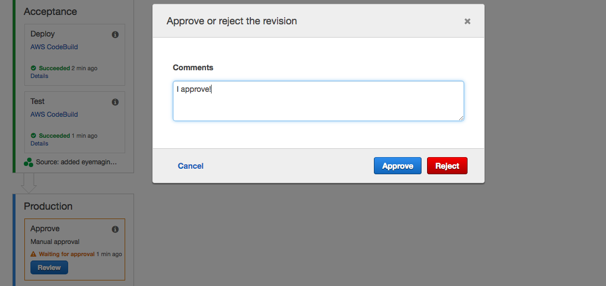

# Rendia Wordpress
WordPress on Amazon ECS and RDS with [Mu](https://getmu.io)

### Overview

AWS CodePipeline orchestrates the continuous delivery pipeline:

1. Watches the [rendia-wordpress]() GitHub repo for changes and automatically applies
   them shortly after you push.
1. AWS CodeBuild uses `buildspec.yml` to run any custom steps you add
   there.
1. AWS CodeBuild generates your own Docker image by combining the results
   of the last step with the [official WordPress image](https://hub.docker.com/r/_/wordpress/) and storing it in
   [Amazon ECR]((http://docs.aws.amazon.com/AmazonECS/latest/developerguide/ECS_Console_Repositories.html)).
1. Container is deployed to "test" environment, fronted by an [Application Load Balancer](https://aws.amazon.com/elasticloadbalancing/applicationloadbalancer/), and backed by backed by an [RDS Aurora database](https://aws.amazon.com/rds/aurora/).
1. Manually inspect your container and approve or reject it within the [CodePipeline UI](https://console.aws.amazon.com/codepipeline/) 
1. If approved, container is deployed to "prod" environment.

Mu creates the applicable AWS resources are created through [AWS CloudFormation](https://aws.amazon.com/cloudformation/) using a pair of simple YAML files.

## Architectural Summary

### Components

GitHub stores your infrastructural code.

mu acts as your front-end to AWS by generating and applying CloudFront
templates, orchestrated by CodePipeline.

The official WordPress Docker container is deployed to Amazon ECS,
and your custom copy is stored in Amazon ECR.

An ECS cluster is run for each environment we define, "test" and "prod".

An AWS ALB sits in front of each cluster.

Your WordPress database will be provided by an Amazon RDS cluster, one for
each environment. Each runs Aurora, Amazon's highly optimized clone of MySQL.

## Getting Started

### Setup

    git clone rendia-wordpress
    cd rendia-wordpress
    ./run-docker-local

Everything in repo's `html` directory will be installed in the containers. Add files there and they'll end up in `/var/www/html`, right alongside WordPress. Want to install persistent plugins?    Put them in `html/wp-content/plugins`. Want to install a theme? Add it to `html/wp-content/themes`.    

When developing wordpress with docker locally, go to `localhost:8000` to view site in browser.

Commit your changes and push them back up to Github:

    git add mu.yml
    git commit -m'first update' && git push

CodePipeline watches repo for changes. Just push your code to trigger updates in your WordPress deployment.

## Databases

Mu manages the database passwords, they can be read them from Amazon's SSM ParameterStore:

    aws ssm get-parameters --names mu-database-mu-wordpress-test-DatabaseMasterPassword --with-decryption
    aws ssm get-parameters --names mu-database-mu-wordpress-prod-DatabaseMasterPassword --with-decryption

## Caveats
Pipeline is configured to only deploy from master branch of org's repo. I recommend creating a fork of org's repo and cloning to local for development.

## References:

* https://getmu.io
* https://stelligent.com/category/mu/
* https://hub.docker.com/r/_/wordpress/
